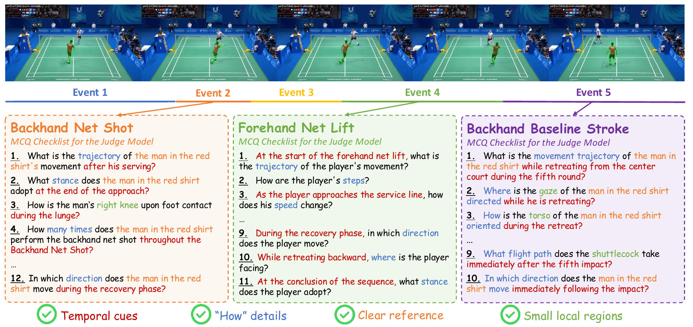
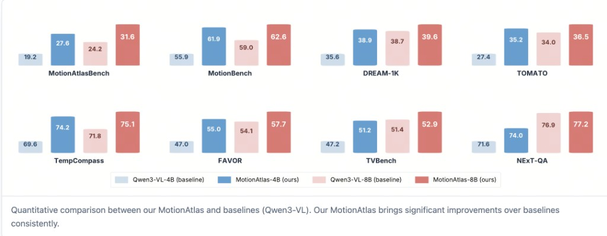
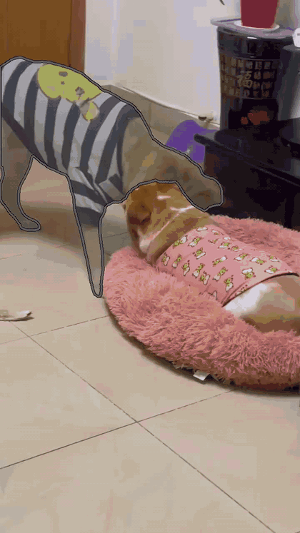
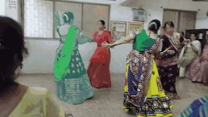
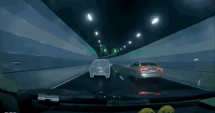
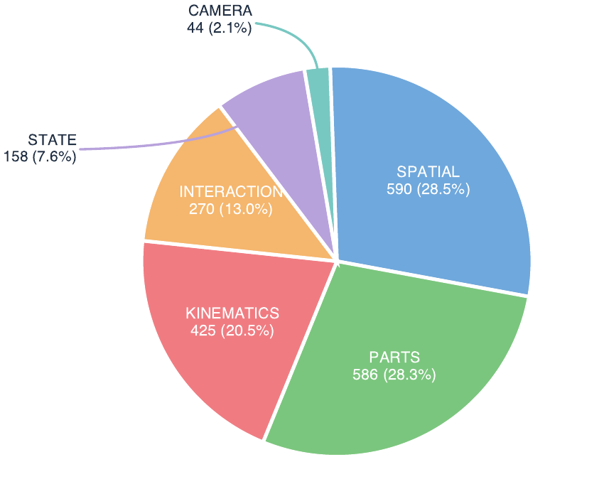

# MotionAtlas: Detailed Region Captioning for Motion-Centric Videos (ECCV 2026)

by
[Weisong Liu](https://scholar.google.com/citations?user=a20rvfAAAAAJ),
[Haochen Wang](https://scholar.google.com/citations?user=oNlpTdcAAAAJ&hl=en),
Kuan Gao,
[Yuhao Wang](https://scholar.google.com/citations?user=BMWOkScAAAAJ&hl=en),
[Yikang Zhou](https://scholar.google.com/citations?user=dZikW2YAAAAJ&hl=en),
[Zhongwei Ren](https://scholar.google.com/citations?user=e5TJm-0AAAAJ&hl=en),
Jacky Mai,
Anna Wang,
[Yanwei Li](https://scholar.google.com/citations?user=I-UCPPcAAAAJ&hl=en),
Jason Li, and
[Zhaoxiang Zhang](https://scholar.google.com/citations?user=qxWfV6cAAAAJ).

[[Paper](https://arxiv.org/abs/2606.29531)] | [[Project Page](https://kagura-0001.github.io/projects/MotionAtlas/)] | [[GitHub](https://github.com/Kagura-0001/MotionAtlas)] | [[MotionAtlas-Data](https://huggingface.co/datasets/maxLWSv2/motionatlas-data)] | [[MotionAtlas-Bench](https://huggingface.co/datasets/maxLWSv2/motionatlas-bench)] | [[Model](https://huggingface.co/maxLWSv2/MotionAtlas-4B)] | [[Citation](#citation)]

**TL;DR**: MotionAtlas is a system for **detailed captioning of motion-centric videos**, comprising (1) a human-annotated benchmark for *region-aware* motion understanding, (2) a scalable, high-quality data pipeline, and (3) a family of Video-MLLMs. Given a video and a spatiotemporal mask, MotionAtlas describes the motion *within the target region*, alleviating visual clutter and motion entanglement, and enabling reliable, quantifiable evaluation.





> **Abstract.** Unlike conventional global motion captioning, we focus on region-aware motion captioning: given a video and a spatiotemporal mask, the model generates precise descriptions of motion within the target region. We first build **MotionAtlas-Bench**, a comprehensive benchmark of 2,073 multiple-choice questions over a curated set of high-quality, motion-centric videos, to evaluate fine-grained motion understanding of the objects in question. We then design a rigorous, scalable data pipeline that leverages self-bootstrap refinement to suppress fine-grained hallucinations, yielding 159K high-quality motion captioning samples (**MotionAtlas-Data**). Finally, a tailored training data composition strategy delivers consistent and substantial gains across diverse baseline Video-MLLMs, including Molmo2 and Qwen3-VL. For instance, MotionAtlas-4B surpasses Qwen3-VL-4B by an average of 5.2 points across general motion benchmarks.

## Updates

- **2026.06.30**: 🤗 Released the [MotionAtlas collection](https://huggingface.co/collections/maxLWSv2/motionatlas-6a3c4bb7c242d1946dc7fa41) on HuggingFace — [MotionAtlas-Bench](https://huggingface.co/datasets/maxLWSv2/motionatlas-bench), [MotionAtlas-Data](https://huggingface.co/datasets/maxLWSv2/motionatlas-data), and the [MotionAtlas-4B](https://huggingface.co/maxLWSv2/MotionAtlas-4B) model. Added MotionAtlas-Bench evaluation code under `evaluation/motionatlas_bench`.
- **2026.06.21**: Repository initialized.

## Resources

| Resource | Link | Description |
| --- | --- | --- |
| **MotionAtlas-Bench** | [🤗 maxLWSv2/motionatlas-bench](https://huggingface.co/datasets/maxLWSv2/motionatlas-bench) | 2,073 region-level motion MCQs over 107 videos for evaluation. |
| **MotionAtlas-Data** | [🤗 maxLWSv2/motionatlas-data](https://huggingface.co/datasets/maxLWSv2/motionatlas-data) | 159K high-quality region-level motion captioning samples for training. |
| **MotionAtlas-4B** | [🤗 maxLWSv2/MotionAtlas-4B](https://huggingface.co/maxLWSv2/MotionAtlas-4B) | Video-MLLM fine-tuned with MotionAtlas-Data. |

# Demos

Examples from **MotionAtlas-Data**. Given a user-specified region (highlighted in each clip), MotionAtlas produces a detailed, temporally grounded description of that region.

<table>
  <tr>
    <td width="42%"></td>
    <td>
      <strong>Region Motion Caption</strong><br><br>
      <p>At the start of the sequence, the boy wearing a blue top stands beside the low horizontal bar. An adult woman in a dark green short-sleeve shirt supports his waist and back to assist him as he performs a forward flip. After the flip, his feet land steadily on the padded mat on the opposite side of the low bar.</p>
      <p>Once stable on his feet, he immediately turns around, walks quickly toward the wooden steps next to the uneven bars, and climbs rapidly to the wooden jumping platform at the top. He then pushes off the platform, leaps upward with both arms fully extended, and grabs the high horizontal bar. Hanging beneath the bar with his arms completely straight, he swings gently back and forth a few times before releasing his grip. He drops straight down onto the thick bright red safety mat directly under the high bar.</p>
      <p>His feet hit the mat first, and he bends his knees naturally to absorb the impact of landing, then straightens up to stand upright. After steadying himself, he turns and walks left across the red mat toward the side of the gym with wall bars and trampolines, moving away from the area under the high bar.</p>
    </td>
  </tr>
  <tr>
    <td width="42%"></td>
    <td>
      <strong>Region Motion Caption</strong><br><br>
      <p>In a static high-angle shot set on a tiled floor, a light brown dog remains standing on all fours on the light beige ceramic tiles next to a pink, long-furred dog bed. Its head is lowered, with its snout close to the head and neck area of a Corgi wearing pink printed clothes inside the bed, repeatedly nudging and sniffing the Corgi with its nose, its attention fully focused on the Corgi throughout, while its tail hangs down naturally and its front legs firmly support its weight.</p>
      <p>When the Corgi in the bed turns around and bites a gray blanket with a white five-pointed star pattern, the light brown dog steps forward to grab the other end of the blanket, engaging in a two-way tug-of-war with the Corgi: it adjusts its center of gravity by slightly shifting its front legs, its body swaying gently with the force of the pulling, during which it briefly lifts a front paw to touch the blanket, and its head moves slightly up, down, forward, and backward following the tugging motions as the two dogs yank the blanket back and forth, its tail lifting slightly and wagging gently during the process.</p>
      <p>After tugging for a while, the Corgi lets go of the blanket and moves close to the light brown dog's snout; the light brown dog lowers its head to nuzzle and sniff snouts with the Corgi, making no further contact with the blanket. When the Corgi grabs the blanket again, plants its front legs on the edge of the dog bed, stands up straight, and lifts its head, the light brown dog also raises its head to interact face-to-face with the upright Corgi, maintaining its standing posture throughout and making minor adjustments to its body position to sustain the interaction.</p>
    </td>
  </tr>
  <tr>
    <td width="42%"></td>
    <td>
      <strong>Region Motion Caption</strong><br><br>
      <p>Filmed on a handheld camera that pans horizontally to track a circular communal dance formation, the footage centers on a female dancer performing the energetic, traditional Indian Garba folk dance, clad in a voluminous black embroidered flared skirt paired with a bright green sheer scarf. Throughout the sequence, she maintains consistent, even spacing from her fellow dancers, aligns her movements perfectly with the collective group rhythm, and uses small, soft stepping motions to coordinate with every turn and positional change across the formation.</p>
      <p>She first appears with her back to the camera, her own right arm raised above her head, her left arm bent loosely in front of her torso swaying gently to the beat, while her green scarf hangs down her back. As she takes small steps and turns gradually to face the viewer&rsquo;s right, her arm positions shift fluidly with the dance. As the dance progresses, two foreground dancers&mdash;one in a deep purple embroidered long skirt, the other in a green top and bright yellow flared skirt&mdash;spin quickly clockwise to exchange positions, briefly obscuring the core dancer entirely; only a narrow strip of her green scarf remains visible during this brief occlusion.</p>
      <p>She continues following the circular path of the formation, spinning rapidly clockwise around her own axis; the centrifugal force of her fast turns flares her heavy skirt out into a smooth, rounded arc while her green scarf is flung forward to float in front of her chest. When she turns her back fully to the camera, she transitions into fast counterclockwise spins, her skirt flaring out almost perfectly horizontal from the force of her rotation, her arms extended diagonally upward and out to her sides. As the clip concludes, she is still mid-spin, facing toward the viewer&rsquo;s front-left, her green scarf floating lightly beside her with the momentum of her turns.</p>
    </td>
  </tr>
  <tr>
    <td width="42%"></td>
    <td>
      <strong>Region Motion Caption</strong><br><br>
      <p>Seen from a first-person perspective traveling through a well-lit tunnel, a dark-colored SUV is initially positioned directly ahead in the left lane. Initial Straight-Driving Phase: the black sedan is centered in the frame, directly ahead of the camera car in the left lane and driving straight toward the background. A silver sedan ahead of it in the right lane accelerates forward and quickly exits the right side of the frame.</p>
      <p>Right Lane-Change Phase: intending to overtake a white vehicle, the distance between the two cars rapidly decreases. The black sedan smoothly steers to the right, gradually crossing the dashed white dividing line, and enters the right lane.</p>
      <p>Emergency Left Evasive Phase: just as the black sedan enters the right lane and accelerates to pass the white car, it immediately activates its left turn signal and makes an emergency swerve to the left, darting back into the left lane and traveling diagonally toward the left side of the frame, getting as close as possible to the solid white line separating the oncoming traffic.</p>
      <p>Post-Evasion Realignment Phase: after fully returning to the left lane, the black sedan crosses paths with a white SUV that has entered the right lane, then makes a minor rightward steering correction to straighten out and continues driving straight ahead in the left lane.</p>
    </td>
  </tr>
</table>

# MotionAtlas-Bench Results

| Model | SF Overall | SF Parts | SF Kinematics | FS Overall | FS Parts | FS Kinematics |
| --- | ---: | ---: | ---: | ---: | ---: | ---: |
| Gemini 3 Pro | 36.4 | 34.7 | 32.0 | 36.5 | 33.5 | 38.1 |
| GPT-5.2 | 36.9 | 34.0 | 34.2 | 37.6 | 38.8 | 36.6 |
| Qwen3-VL-235B | 30.5 | 27.8 | 28.9 | 33.7 | 33.2 | 31.1 |
| Qwen3-VL-4B | 19.3 | 20.0 | 14.1 | 21.7 | 22.4 | 16.5 |
| MotionAtlas-4B (from Qwen3-VL-4B) | 27.7 | 27.9 | 26.9 | 30.1 | 30.3 | 29.3 |

SF = Single-Frame Grounding, FS = Full-Sequence Grounding. Values are accuracy (%).

# Evaluation Quick Start

MotionAtlas-Bench evaluation code lives under `evaluation/motionatlas_bench`. It implements the **caption-to-judge** protocol used by the benchmark: a Video-MLLM first generates a target-object motion caption from highlighted video frames, then a text judge answers each MCQ given only that caption. The judge classifies every answer as `correct` / `wrong` / `miss`, from which we report **Accuracy**, **Recall** (tendency to describe the target motion rather than answer "not mentioned"), and **Precision** (correctness when the motion is explicitly mentioned), plus a `weighted_score`.

The benchmark provides two increasingly difficult **grounding settings**:

- **`first_mask`** (Single-Frame Grounding): the target mask is shown **only at its first visible frame**, so the model must track the entity through the clip — jointly testing spatial tracking and motion understanding.
- **`overlay_all`** (Full-Sequence Grounding): per-frame masks are overlaid on **every frame**, removing tracking ambiguity to strictly measure intrinsic motion captioning capacity.

## 1. Environment

Install dependencies from the provided `pyproject.toml` with `uv`:

```bash
uv sync
```

If you also serve the Qwen3-VL caption model with the provided vLLM script, install the optional serving group. The CUDA 12.9 PyTorch and vLLM wheel sources are pinned in `pyproject.toml`:

```bash
uv sync --group serve
```

The base environment covers the MotionAtlas-Bench runner, mask rendering, Gemini judging, and the `hf` download CLI used below. The `serve` group adds `vllm` for Step 3.

## 2. Download MotionAtlas-Bench

MotionAtlas-Bench is gated; accept the terms on the [dataset page](https://huggingface.co/datasets/maxLWSv2/motionatlas-bench), then log in and download:

```bash
uv run hf auth login
uv run hf download maxLWSv2/motionatlas-bench --repo-type dataset --local-dir ../motionatlas-bench-v1
```

The release contains `mcqs.jsonl` (one MCQ per line), the `videos/` media referenced by `video_path` (either `.mp4` files or directories of ordered image frames), and dataset bookkeeping (`manifest.json`, `checksums.sha256`).

## 3. Serve the Caption Model

Start a Qwen3-VL vLLM server. On an 8-GPU node, Qwen3-VL-4B is best served as eight data-parallel replicas behind a single OpenAI-compatible endpoint:

```bash
MODEL_PROFILE=qwen4b \
MODEL_PATH=Qwen/Qwen3-VL-4B-Instruct \
MODEL_NAME=qwen3-vl-4b \
TP_SIZE=1 \
DP_SIZE=8 \
DP_BACKEND=mp \
MAX_NUM_SEQS=8 \
PORT=8000 \
uv run bash scripts/serve_qwen3vl_vllm.sh
```

To evaluate our released model instead, point `MODEL_PATH` at [`maxLWSv2/MotionAtlas-4B`](https://huggingface.co/maxLWSv2/MotionAtlas-4B). The serve script defaults to `DP_SIZE=1` for portability; set `DP_SIZE=8` on 8-GPU nodes to expose one vLLM replica per GPU. Reduce `DP_SIZE` and `MAX_NUM_SEQS` if GPU memory is tight.

## 4. Run MotionAtlas-Bench

```bash
export GEMINI_API_KEY=YOUR_GEMINI_API_KEY

uv run python -m evaluation.motionatlas_bench.run_eval \
  --data-root ../motionatlas-bench-v1 \
  --output outputs/qwen3vl4b_first_mask_16_gemini25pro \
  --setting first_mask \
  --num-frames 16 \
  --caption-model qwen3-vl-4b \
  --caption-base-url http://127.0.0.1:8000/v1 \
  --caption-api-key EMPTY \
  --caption-workers 32 \
  --judge-provider gemini \
  --judge-model gemini-2.5-pro \
  --judge-workers 8
```

This writes `captions.jsonl`, `judge_predictions.jsonl`, `metrics.json`, and `run_config.json` under the output directory. Use `--setting overlay_all` for the all-mask (Full-Sequence) setting. The prompt labels images as `Frame 1:`, `Frame 2:`, and so on, matching the model input sequence; original zero-based public media frame indices are kept only in `render_metadata`. Reduce `--caption-workers` if GPU memory is tight.

To use a **local OpenAI-compatible text judge** instead of Gemini, serve it with vLLM and switch the judge provider:

```bash
uv run python -m evaluation.motionatlas_bench.run_eval \
  --data-root ../motionatlas-bench-v1 \
  --output outputs/qwen3vl4b_first_mask_16_qwen_judge \
  --setting first_mask \
  --num-frames 16 \
  --caption-model qwen3-vl-4b \
  --caption-base-url http://127.0.0.1:8000/v1 \
  --caption-api-key EMPTY \
  --caption-workers 16 \
  --judge-provider openai-compatible \
  --judge-model qwen3.6-27b \
  --judge-base-url http://127.0.0.1:8001/v1 \
  --judge-api-key EMPTY \
  --judge-workers 16
```

The reported metrics span six motion aspects — **Spatial**, **Parts**, **Kinematics**, **Interaction**, **State**, and **Camera**. See the paper for full benchmarked results across base models and grounding settings.

<p align="center">
  
</p>

# Training

MotionAtlas training follows the same lightweight entrypoint style as GAR: one config, one distributed launch command, and one checkpoint conversion command.

```bash
# 1. Inspect dataset/media wiring.
python projects/motionatlas/tools/inspect_dataset.py \
  projects/motionatlas/configs/qwen3vl_4b_motionatlas.yaml \
  --limit 32

# 2. Train Qwen3-VL-4B with MotionAtlas-Data.
bash scripts/train_qwen3vl.sh

# 3. Convert the training checkpoint to HuggingFace format.
python projects/motionatlas/tools/convert_to_hf.py \
  --config projects/motionatlas/configs/qwen3vl_4b_motionatlas.yaml \
  --checkpoint work_dirs/qwen3vl_4b_motionatlas/iter_xxx.pth \
  --base-model /path/to/Qwen3-VL-4B-Instruct \
  --output-dir outputs/MotionAtlas-4B
```

See [`docs/training.md`](docs/training.md) for environment setup, MotionAtlas-Data media roots, smoke runs, and conversion details.

# License

This project is licensed under the [Apache-2.0 License](LICENSE). Benchmark annotations and media are released for MotionAtlas-Bench evaluation; media files may also be subject to the licenses or terms of their original sources.

# Citation

If you find this project useful, please consider citing:

```bibtex
@article{liu2026motionatlas,
  title   = {MotionAtlas: Detailed Region Captioning for Motion-Centric Videos},
  author  = {Liu, Weisong and Wang, Haochen and Gao, Kuan and Wang, Yuhao and Zhou, Yikang and Ren, Zhongwei and Mai, Jacky and Wang, Anna and Li, Yanwei and Li, Jason and Zhang, Zhaoxiang},
  journal = {arXiv preprint arXiv:2606.29531},
  year    = {2026},
  eprint  = {2606.29531},
  archivePrefix = {arXiv},
  url     = {https://arxiv.org/abs/2606.29531}
}
```

# Acknowledgements

We thank the data sources that make MotionAtlas possible, including [SA-V](https://ai.meta.com/datasets/segment-anything-video/), [MeViS](https://huggingface.co/datasets/FudanCVL/MeViS), [TAO](https://huggingface.co/datasets/chengyenhsieh/TAO-Amodal), [DanceTrack](https://huggingface.co/datasets/noahcao/dancetrack), [ViCaS](https://huggingface.co/datasets/Ali2500/ViCaS), [VastTrack](https://github.com/HengLan/VastTrack), and [GOT-10k](http://got-10k.aitestunion.com/). Our evaluation follows the protocols of [lmms-eval](https://github.com/EvolvingLMMs-Lab/lmms-eval) and [VLMEvalKit](https://github.com/open-compass/VLMEvalKit).
